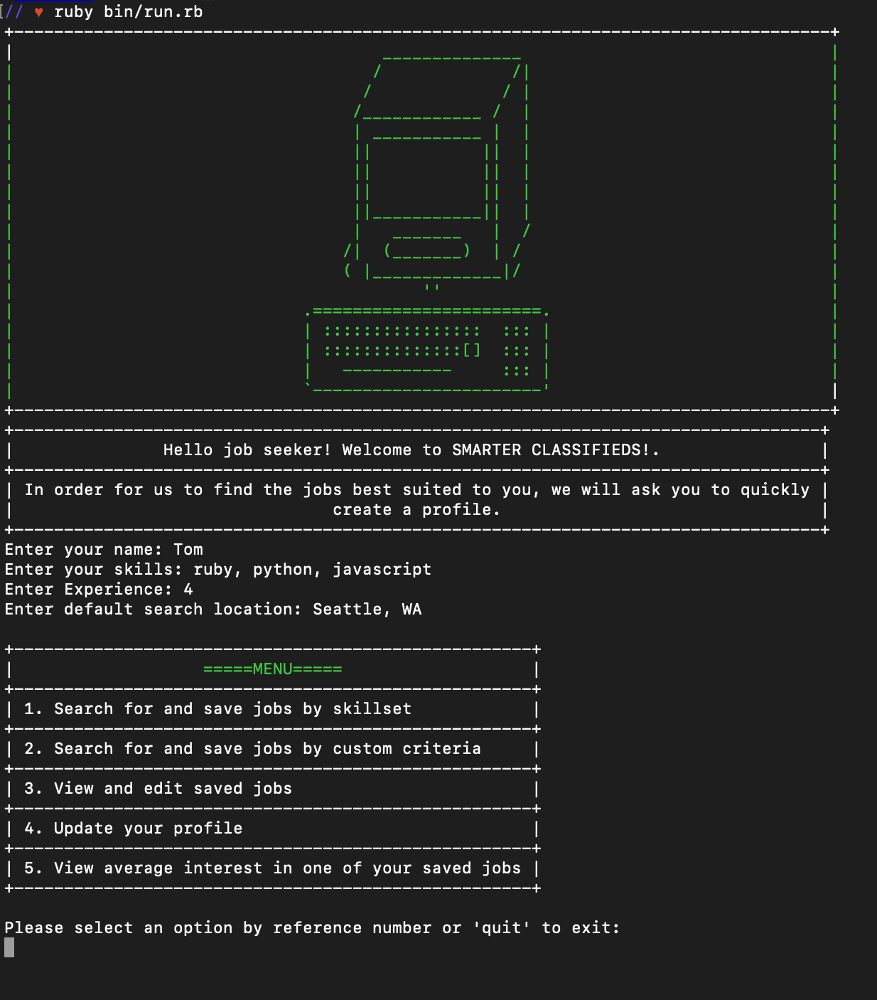
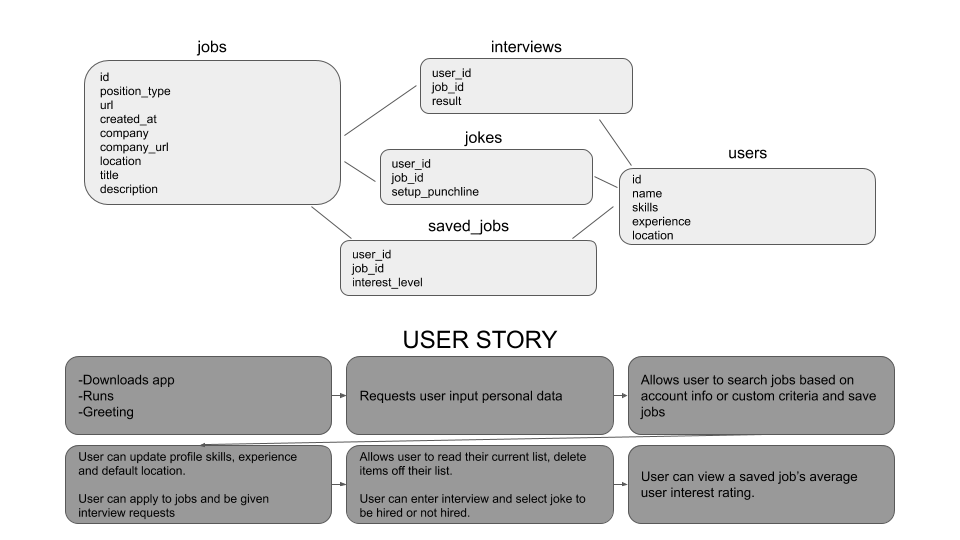

Smarter Classifieds aka GitHub Job Search Tool
========================

This job search CLI allows users to search for jobs using the GitHub jobs API. Users can search based on their skillset and location and save jobs they are interested in.


Happy job hunting!

---

## Minimum Program Requirements

macOS:

- [Ruby](https://www.ruby-lang.org/en/documentation/installation/)

- [Homebrew](https://brew.sh/)

---

## Installation and Setup

To download the CLI application clone the repository from GitHub and change your current directory to the cloned repository.

Next you will need to install a few things. Run the following in your terminal from the top of the project directory:


```ruby
ruby setup.rb #installs dependencies  

bundle install #this will install all required gems
```

Next you will need to setup the database. Run the following command in your terminal at the top of the directory:

```ruby
rake setup_db
```


Now you're all setup to run the program!

## Running the Program


To start the program run the following command in your terminal at the top of the directory:

```ruby
ruby bin/run.rb
```

The main menu will display options for commands you can make to the program. If you would like to exit out of the program from the main menu just type quit.

Program menu:



Below you will find a video that demonstrates how you can use the program:

[Demo Video](https://www.youtube.com/watch?v=pMwxafmxXrQ&t=8s)

###### Note:
If you would like to refresh the job postings, you will need to delete the database (development.db) from your computer and re-seed the data by entering the following command:

```ruby
rake setup_db
```

 Be aware that deleting the database will delete all of the user profile info you have entered in the application as well as any saved jobs you may have.

## Models



This flowchart shows the models in this application and their relationships. Additionally the user story is detailed with different functionalities of this program.

## Uninstalling Dependencies

If you would like to uninstall the dependencies after use enter the following command at the top of the directory:

```
ruby uninstall.rb
```


### License

###### Learn.co Educational Content License

Copyright (c) 2015 Flatiron School, Inc

The Flatiron School, Inc. owns this Educational Content. However, the Flatiron School supports the development and availability of educational materials in the public domain. Therefore, the Flatiron School grants Users of the Flatiron Educational Content set forth in this repository certain rights to reuse, build upon and share such Educational Content subject to the terms of the Educational Content License set forth here (http://learn.co/content-license). You must read carefully the terms and conditions contained in the Educational Content License as such terms govern access to and use of the Educational Content.

Flatiron School is willing to allow you access to and use of the Educational Content only on the condition that you accept all of the terms and conditions contained in the Educational Content License set forth here (http://learn.co/content-license). By accessing and/or using the Educational Content, you are agreeing to all of the terms and conditions contained in the Educational Content License. If you do not agree to any or all of the terms of the Educational Content License, you are prohibited from accessing, reviewing or using in any way the Educational Content.
